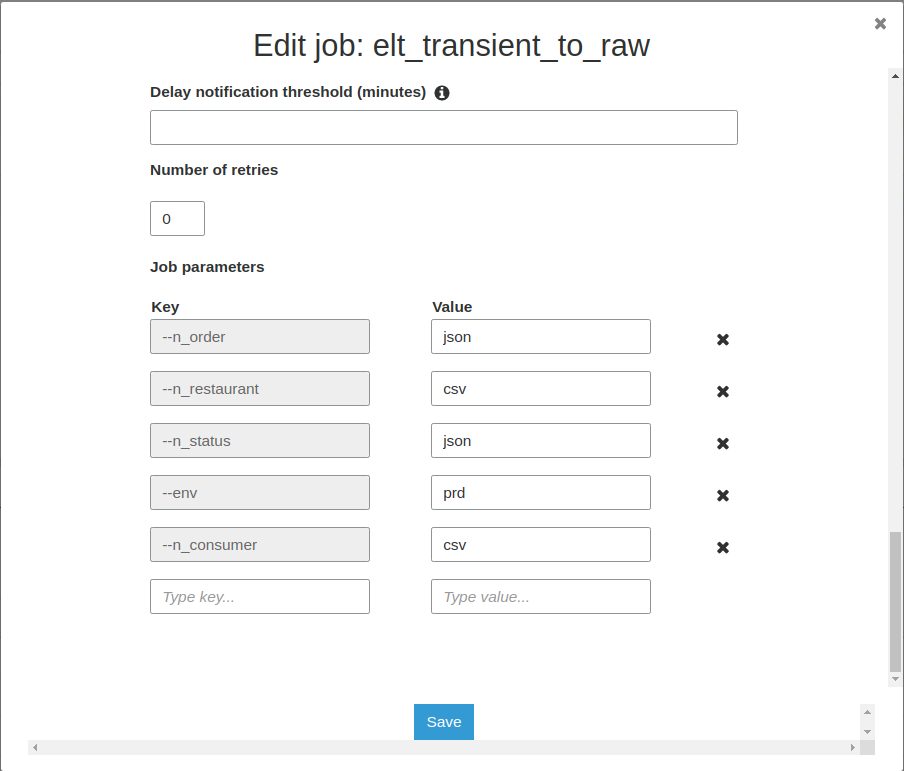
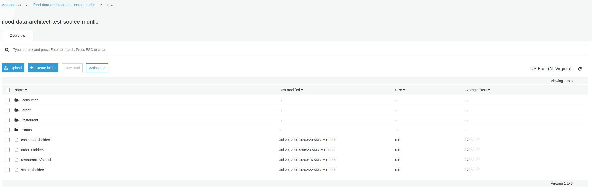
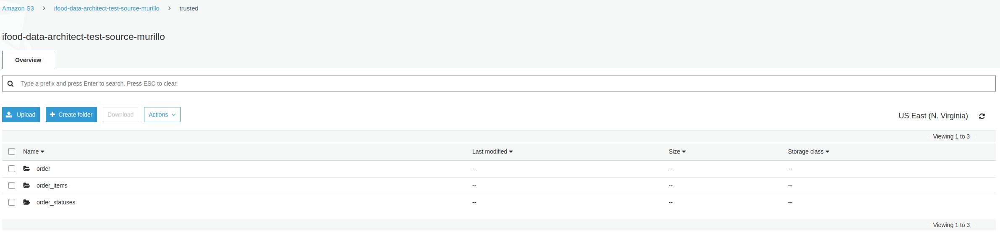

# iFood Data Architect Test Solve

All the process was development using AWS.

Firts of all, everthing starts with creation AWS Free, after that, I created all rules and users.

## Basically the test consist in two parts
  
1. Source(transient) to Raw:

The script for convert source data to parquet is called `etl_transient_to_raw.py`, it's possible to parametter the dataset name and type(csv or json) for starting the convert.

The result is all files are saved in "parquet" in the Raw zone of lake.

2. Raw to Trusted:

the script follows these requirements:

* Order dataset - one line per order with all data from order, consumer, restaurant and the LAST status from order statuses dataset. To help analysis, it would be a nice to have: data partitioned on the restaurant LOCAL date.

* Order Items dataset - easy to read dataset with one-to-many relationship with Order dataset. Must contain all data from order items column.

* Order statuses - Dataset containing one line per order with the timestamp for each registered event: CONCLUDED, REGISTERED, CANCELLED, PLACED.

#### Order:
Source: `raw.order + raw.consumer + raw.restaurant`
Deduplication: First `raw.order` and then `raw.status` (raw.restaurant had no duplicated items)
Anonymize: cpf and *customer_phone_number*
Save: It was saved partitioned today date in `trusted` zone with called `order` dataset.

#### Order Items:
Source: `trusted.order`
Process: It was inferred schema in `items` column, exploded items and garnish.
Save: It was saved partitioned today date in `trusted` zone with called `order_items` dateset.

#### Order Statuses:
Source: `trusted.order + raw.status`
Process: It was create view using spark sql.
Save: It was saved partitioned today date in `trusted` zone with called `order_statuses` dateset.

#### Some other points:
* The cpf column was hashed using sha2 256 for encrypt.
* The phone column was hashed using a simple count(value * 5 / 2).
* If the current dataset is 80% different from the previous one, then the current dataset is not saved in the Trusted zone.

### Evaluator Credentials:
The evaluator can access AWS account for verifying the test through:

    Account Id: 569290705131
    User: test_evaluator
    Pass: test_evaluator20072020

##### Thank you all for the opportunity to participate in the test.