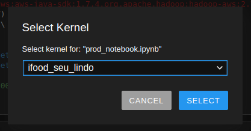

# iFood Data Architect Test Solve

The process was development using AWS.

To be able to test the process, a free AWS account was created with necessary users and rules.

## Test Requeriments

Check out: [Here](https://github.com/ifood/ifood-data-architect-test)

## Local Getting Started

The step by step are:

* Setup your local machine with virtualenv

```bash
$ sudo apt-get install python-virtualenv

$ virtualenv -p python3 ~/Documents/ifood_test

$ . ~/Documents/ifood_test/bin/activate
```

* After install and activate the virtual env, please folow:

```bash
$ pip install pyspark==2.4.6

$ pip install ipykernel

$ ipython kernel install --user --name="ifood_seu_lindo"
```

Open your local Jupyter.

* If you don't have installed, please install:
```bash
$ pip install jupyterlab
```

```bash
$ jupyter lab
```
Acess your web browser, and then acess`http://localhost:8888/lab`

Open `dev_notebook.ypynb` or `prod_notebook.ipynb` file.

Select kernel `ifood_seu_lindo`



Execute cell by cell as you wish.


## The test consist in two parts.

I created the "production" solution in Aws Glue, but there's several ways to do that.
  
1. Source(transient) to Raw:

The script for convert source data to parquet is called `etl_transient_to_raw.py`, it's possible to parametter the dataset name and type(csv or json) for starting the convert.


The result is all files are saved in "parquet" in the Raw zone of lake.


2. Raw to Trusted:

#### Order:
Source: `raw.order + raw.consumer + raw.restaurant`
Deduplication: First `raw.order` and then `raw.status` (raw.restaurant had no duplicated items)
Anonymize: cpf and *customer_phone_number*
Save: Partitioned the dataset with the day execution in the `trusted` zone with called `order` dataset.

#### Order Items:
Source: `trusted.order`
Process: Inferred schema in `items` column, exploded items and garnish.
Save: Partitioned the dataset with the day execution in the `trusted` zone with called `order_items` dateset.

#### Order Statuses:
Source: `trusted.order + raw.status`
Process: Created view using spark sql.
Save: Partitioned the dataset with the day execution in the `trusted` zone with called `order_statuses` dateset.


#### Some other points:
* The cpf column was hashed using sha2 256 for encrypt.
* The phone column was hashed using a simple count(value * 5 / 2).
* If the current dataset is 80% lower from the previous one, then the current dataset is not saved in the Trusted zone.

### Evaluator Credentials:
The evaluator can access AWS account for verifying the test through:

    Account Id: 569290705131
    User: test_evaluator
    Pass: test_evaluator20072020

##### Thank you all for the opportunity to participate in the test.
